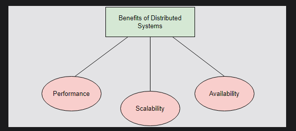
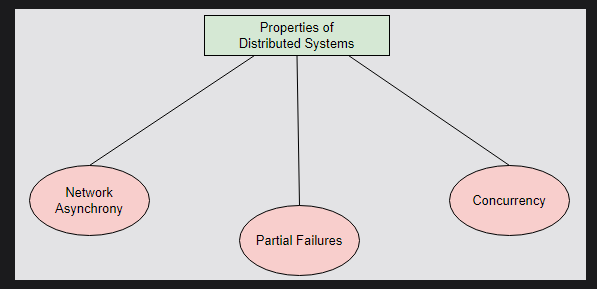
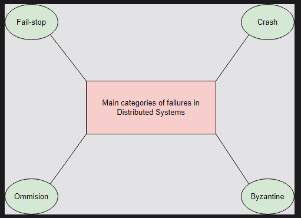

# Distributed System
A distributed system is a system whose components are located on different networked computers, which communicate and coordinate their actions by passing messages to one another.

The components of this system can be thought of as software programs that run on physical hardware, such as computers. These components take many forms; e.g., they can be web servers, routers, web browsers, etc. To keep a generic view, we assume that each program runs on a separate machine. We refer to each of these machines as a node.

## Why we need a distributed system

- Performance is the degree to which a software system or component meets its objectives for timeliness.

    #### Problem with a single computer
    - The physical constraints of its hardware impose certain limits on the performance of a single computer. Moreover, it is extremely expensive to improve a single computer’s performance after a certain point.

    #### Solution
    - We can achieve the same performance with two or more low-spec computers as with a single, high-end computer. So, distributed systems allow us to achieve better performance at a lower cost.

- Scalability is the capability of a system, network, or process to handle a growing amount of work, or its potential to be enlarged to accommodate that growth.

    #### Problem with a single computer
     - Data storage and processing are responsible for most of the value that software systems impart in the real world. As a system’s customer base grows, the system needs to handle more traffic and store larger amounts of data. However, a system that comprises a single computer can only scale up to a certain point,

    #### Solution
    - If we build a distributed system, we can split and store the data in multiple computers, and distribute the processing work.

- Availability emphasizes the importance of a system, particularly online services, being operational nearly all the time (e.g., achieving five-nine availability, or 99.999% uptime(we know availability is measured in 9's)). This is crucial for services that are expected to run 24/7, where even minimal downtime can be unacceptable.  

    #### Problem with a single computer
    - Nowadays, most online services need to operate all the time (also known as “24/7 service”), which is a huge challenge. When a service states that it has five-nine availability, it usually operates 99.999% of the time. This implies that it can be down for only 5 minutes at most per year to satisfy this guarantee.

    - If we consider how unreliable hardware can be, we can easily understand how big an undertaking this is. Of course, it would be infeasible to provide this kind of guarantee with a single computer.

    #### Solution
    - Redundancy is one of the widely used mechanisms to achieve higher availability. It refers to storing data into multiple, redundant computers. So, when one computer fails, we can efficiently switch to another one. This way, we’ll prevent our customers from experiencing this failure

## Why distributed systems are hard to design   
 There are properties of distributed system which makes it hard to design

 

 - Network asynchrony refers to the unpredictable nature of message delivery times in distributed systems, where there are no strong guarantees on when or in what order messages will arrive, contrasting with the more reliable and predictable behavior of memory operations in non-distributed systems. They may even deliver out of order—or not at all.

- Partial failures are the cases where only some components of a distributed system fail. This behavior can contrast with certain kinds of applications a single server deploys. These applications work under the assumption that either everything is working fine, or there has been a server crash. It introduces significant complexity when it requires atomicity across components in a distributed system. Thus, we must ensure that we either apply an operation to all the nodes of a system, or to none of them.

- Concurrency is the execution of multiple computations at the same time, and potentially on the same piece of data. These computations interleave with each other. This introduces additional complexity since these computations can interfere with each other and create unexpected behaviors. This is, again, in contrast to simplistic applications with no concurrency, where the program runs in the order the sequence of commands in the source code defined.

## Types of Failures

1. Fail-stop
A node halts and remains halted permanently. Other nodes can detect that the node has failed (i.e., by communicating with it).

2. Crash
A node halts, but silently. So, other nodes may not be able to detect this state. They can only assume its failure when they are unable to communicate with it.

3. Omission
A node fails to respond to incoming requests.

4. Byzantine
A node exhibits arbitrary behavior: it may transmit arbitrary messages at arbitrary times, take incorrect steps, or stop.

    Byzantine failures occur when a node does not behave according to its specific protocol or algorithm. This usually happens when a malicious actor or a software bug compromises the node.